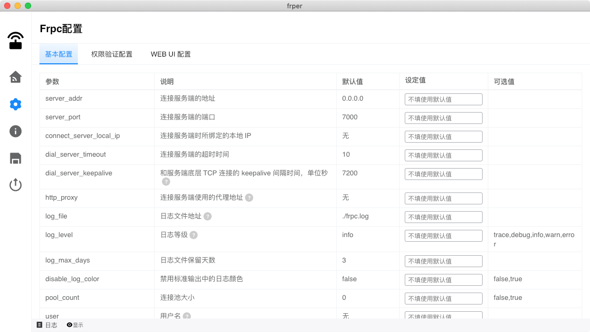

# frper
A desktop gui project for frp powered by rust and sciter(frp桌面客户端基于rust和sciter)

> free frps servers see [freefrp.net](https://freefrp.net/)

**Warning: do not transfer any sensitive information through a free frps server**

## development

+ see [rust](https://www.rust-lang.org)
+ see [sciter-rs](https://github.com/sciter-sdk/rust-sciter#getting-started)
+ see [sciter-js-sdk](https://gitlab.com/sciter-engine/sciter-js-sdk/-/tree/main)

## features

+ Use frpc
+ Gui configuration
+ Apply frpc.ini export

## Useage

+ Choose a free frps server domain name from [freefrp.net](https://freefrp.net/) and copy it.
+ On you domain name dns setting. add a dns record, with CNAME type, content is frps domain name from copied.
  and sub domain name is what any you want. also you can provide a wildcard domain name such as "*.frp" or any others.

##  Screenshot

